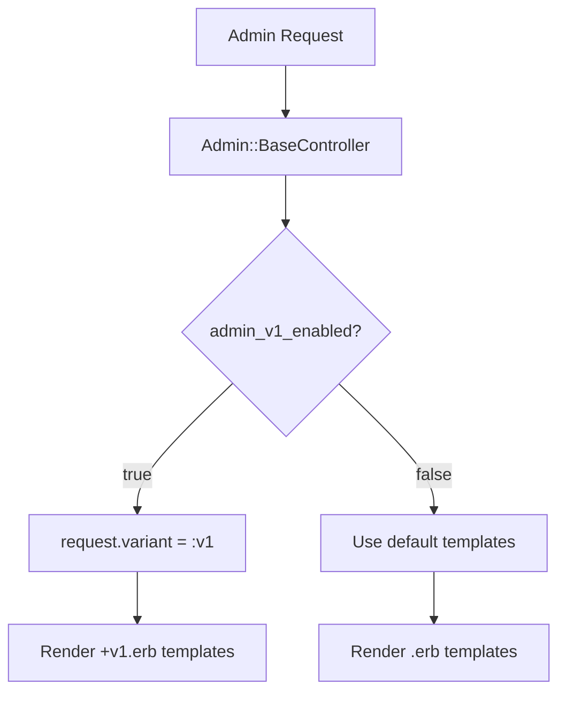

# Admin V2 Default Interface Migration System Design Document

## Feature Overview
Make TailwindCSS-based V2 interface the default experience while providing legacy V1 support through feature flags. The migration inverts the current template hierarchy and simplifies variant logic by removing URL parameter support.

## Architecture Planning

### File Structure
```
app/controllers/admin/
├── base_controller.rb           # Update variant logic
└── feature_toggles_controller.rb # Update feature flag handling

app/views/admin/
├── layouts/
│   ├── admin.html.erb           # V2 layout (renamed from +v2.erb)
│   └── admin.html+v1.erb        # V1 layout (renamed from .erb)
├── shared/
│   ├── _sidebar.html.erb        # V2 sidebar (renamed from +v2.erb)
│   └── _sidebar.html+v1.erb     # V1 sidebar (renamed from .slim)
└── [all admin view directories]/
    ├── *.html.erb               # V2 templates (renamed from +v2.erb)
    └── *.html+v1.erb            # V1 templates (renamed from .erb)

lib/tasks/
└── admin_migration.rake         # Batch rename script
```

### System Architecture Diagram


### Key Architectural Features
- **Inverted Template Hierarchy**: V2 becomes default (.erb), V1 becomes variant (+v1.erb)
- **Simplified Variant Logic**: Only check `admin_v1_legacy` feature flag
- **Remove URL Parameter Support**: No longer support `?variant=v2`

## Interface Contracts

### Components

**Controller Updates** (Modify Existing Components)
```ruby
# app/controllers/admin/base_controller.rb
class Admin::BaseController < ApplicationController
  before_action do
    request.variant = :v1 if admin_v1_enabled?
  end

  private

  def admin_v1_enabled?
    Flipper.enabled?(:admin_v1_legacy, current_admin_user)
  end

  # Remove old admin_v2_enabled? method
end
```

**Feature Toggle Updates**
```ruby
# app/controllers/admin/feature_toggles_controller.rb
def update
  feature = :admin_v1_legacy  # Fixed to use new feature flag
  actor = current_admin_user

  if Flipper.enabled?(feature, actor)
    Flipper.disable_actor(feature, actor)
  else
    Flipper.enable_actor(feature, actor)
  end

  redirect_back(fallback_location: admin_root_path)
end
```

**Batch Rename Script**
```ruby
# lib/tasks/admin_migration.rake
namespace :admin do
  desc "Migrate templates to V2 default"
  task migrate_templates: :environment do
    # 1. Rename .erb -> +v1.erb
    # 2. Rename +v2.erb -> .erb
    # 3. Handle .slim -> +v1.erb conversion
  end
end
```

## Technical Details

### Development Environment Requirements
- Rails 8.0.2 with Flipper integration
- Existing TailwindCSS 4.0 build pipeline

### Dependencies
- `flipper-rails` (already installed)
- Existing view helper methods

### Configuration Files
- Update sidebar feature toggle routing
- Configure new `admin_v1_legacy` feature flag

### Testing Strategy
- Update controller tests to verify new `admin_v1_enabled?` logic
- Update feature tests to verify correct template rendering
- Cucumber tests to validate user scenarios

### Deployment Considerations
- Batch template renaming can be executed with zero downtime
- Feature flag can be gradually enabled for users who need legacy interface